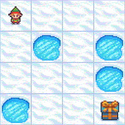
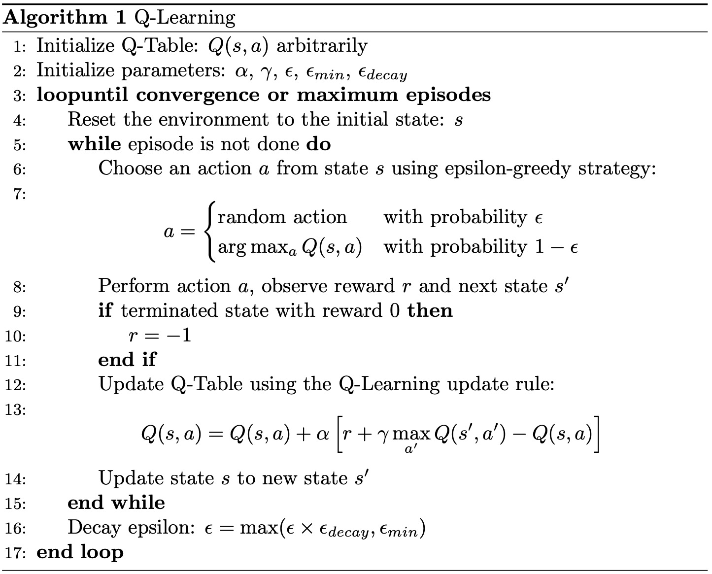
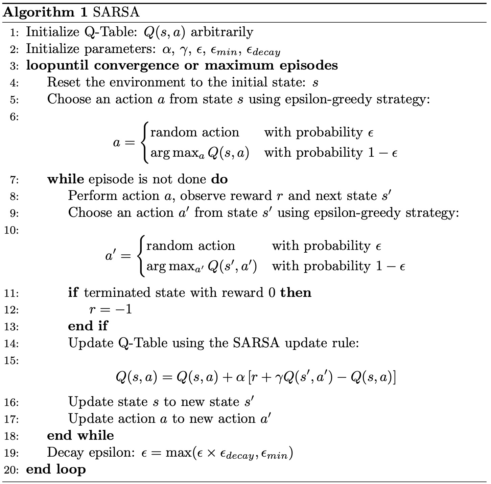

## Assignment 1: Temporal Difference (TD) Learning: Implementing Q-Learning and SARSA for the FrozenLake Environment

In this assignment, you will implement the Q-learning and SARSA algorithms to solve the FrozenLake environment in OpenAI Gym. By completing this assignment, you will gain a comprehensive understanding of the key characteristics of the Q-learning and SARSA algorithms, as well as the main differences between them.

### Outline
- Introduction to FrozenLake
- Q-Learning (off-policy)
- SARSA (on-policy)
- Grading Policy & Submission

---

### Detailed Information about FrozenLake
FrozenLake is a classic reinforcement learning environment provided by OpenAI Gym. It consists of a grid world where an agent must navigate from a starting position to a goal position while avoiding holes that can cause it to fall through the ice and fail. The objective is to reach the goal as quickly and safely as possible.

  

#### Key Features:
- **Grid Size**: Typically 4x4 or 8x8 grid.
- **States**: Each cell in the grid represents a state.
- **Actions**: The agent can move in four directions: left, right, up, and down.
- **Rewards**: The agent receives a reward of 1 for reaching the goal and 0 otherwise. A negative reward can be introduced for falling into a hole.
- **Stochasticity**: The environment can be slippery, meaning the agent's actions might not always lead to the expected next state, introducing randomness in movement.

For more details, you can visit the [OpenAI Gym FrozenLake documentation](https://www.gymlibrary.dev/environments/toy_text/frozen_lake/).

---

### Q-Learning (Off-policy) Introduction

  

---

### SARSA (On-Policy) Introduction

  

---

### Grading Policy & Submission

### Grading Policy

1. #### Code Template Explanation

   The code samples for Assignment 1 have been provided in the `code` folder. Below is the structure of the folder:

   - **checkpoints/** - This folder is used for saving Q tables learned by Q-learning and SARSA.
   - **td_learning/** - This folder contains the code samples for TD learning.
      - **td_agent.py** - This is the parent class for TD learning.
      - **sarsa.py** - This file contains the concrete implementation of the SARSA algorithm, which inherits from `td_agent`.
      - **q_learning.py** - This file contains the concrete implementation of the Q-learning algorithm, which inherits from `td_agent`.
   - **main.py** - This is the main file used to train and test the implementation of Q-learning and SARSA.
   - **test.py** - This is the test file that the TA will use to evaluate the performance of the implemented Q-learning and SARSA algorithms.
   - **requirements.txt** - This file stores all the required Python libraries for this project.

---

2. #### Instructions for Using Code Samples

   1. **Download the Code Sample Files**
      - Download the files from the `code` folder and place them in your project directory.

   2. **Implement the Key Code Segments**
      - In the `td_learning` folder, complete the key code segments in the `q_learning.py` and `sarsa.py` files. These segments are marked with "Student Implementation:..." and can be completed using the provided "Hints:".

   3. **Run the Training and Testing Phases**
      - **Training**: `python main.py --train_ql --train_sa`
      - **Testing**: `python main.py --test_ql --test_sa`

   4. **Analyze the Learning Performance and Write a Report**

   For more detailed user instructions of the code, please refer to the Readme document in the `code` folder.

---   

3. #### Code Implementation
   - Q-learning
   - SARSA 

   During the training procedure, it is normal to observe different results across iterations even when a random seed is set. This variability arises because the environment itself incorporates inherent randomness.
   
---

4. #### Report Submission 
- Task 1
   
   Plot the learning curve to show the performance of Q-learning and SARSA on Frozen Lake.
   - **X-axis**: Number of time steps
   - **Y-axis**: Average reward in the last 50 episodes

   Describe the difference between Q-learning and SARSA based on your understanding.

- Task 2 
   
   Remove the negative reward component (comment line 55 and 56 of q_learning.py) from Q-learning. Then, plot the learning curve and analyze the performance differences between the original version and the modified version.

- Task 3 
   
   Remove the $\epsilon$-greedy action selection strategy from Q-learning, and always select the action with the highest value. Then, plot the learning curve and analyze the performance differences between the original version and the modified version.

- Task 4 
   
   Remove the $\epsilon$ decay strategy (comment line 64 of q_learning.py) from Q-learning, maintaining the original value throughout. Then, plot the learning curve and analyze the performance differences between the original version and the modified version.

- Task 5 

   Change the value of $\gamma$ (discount factor) in Q-learning from 0.1 to 0.5, then to 0.9, and finally to 1.0. Plot the learning curves and analyze the performance differences in the four cases.

