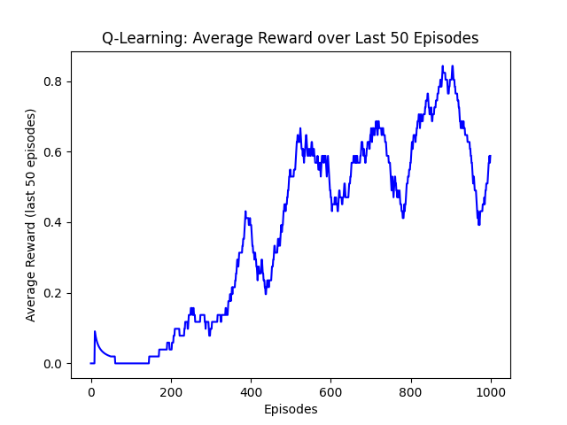
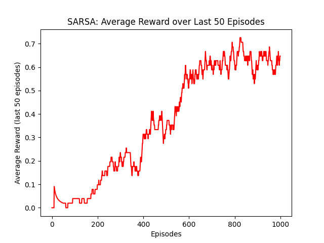
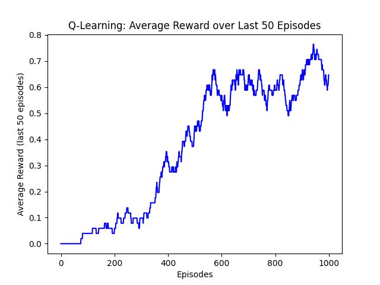
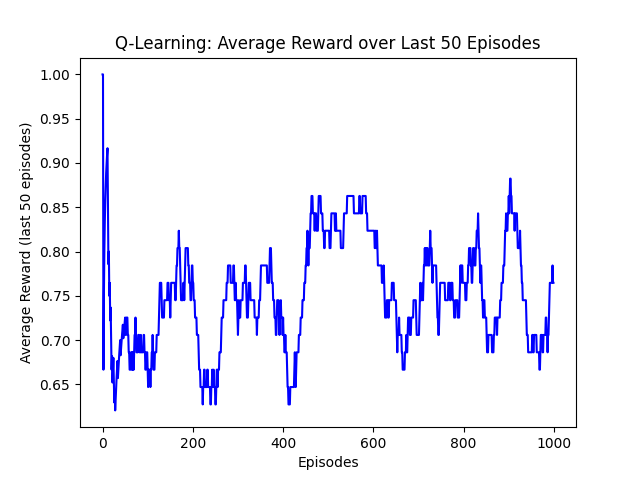
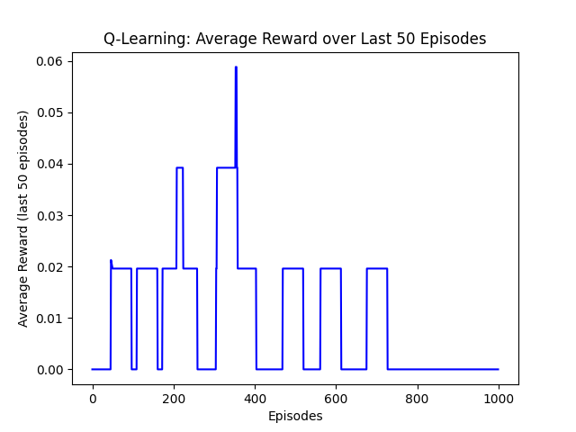
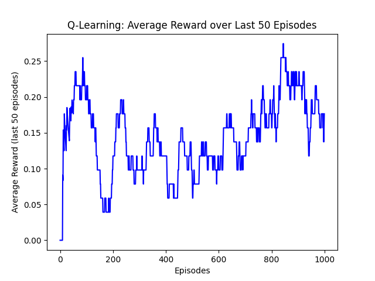
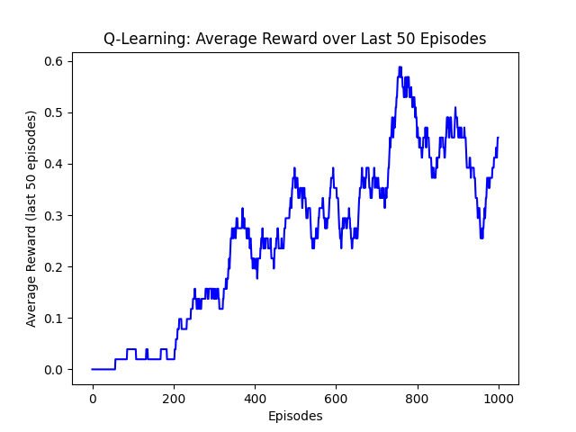
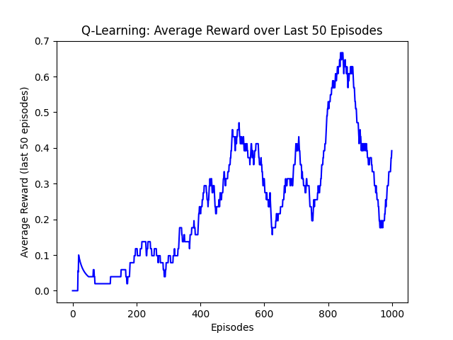
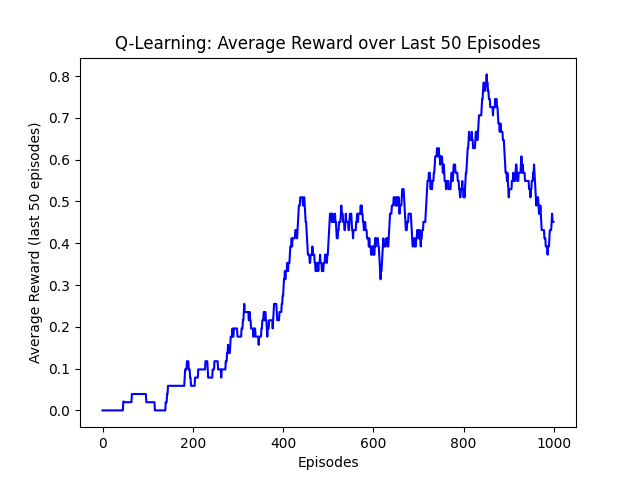
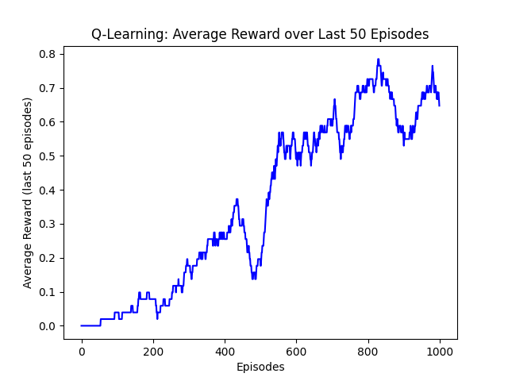

# Report On CISC7401-002 Homework 1

## Task 1

### Requirement

Plot the learning curve to show the performance of Q-learning and SARSA on Frozen Lake.

- **X-axis**: Number of time steps

- **Y-axis**: Average reward in the last 50 episodes

Describe the difference between Q-learning and SARSA based on your understanding.

### Result

In this task, I filled in the key code segments in the `q_learning.py` and `sarsa.py` files to implement the Q-learning and SARSA algorithms according to the pseudocode given. After running the training phase, I plotted the learning curves for both algorithms, which are shown below.

|                   Q-learning                   |                   SARSA                   |
|:----------------------------------------------:|:-----------------------------------------:|
|  |  | 

Q-learning and SARSA are both model-free reinforcement learning algorithms that learn the value of actions in a given state. The main difference between the two lies in how they update their action-value estimates.

According to the plots, we can see that both algorithms show an increasing trend in average rewards over time, indicating that they are learning to perform better in the Frozen Lake environment. However, the learning curves may differ in terms of convergence speed and stability.

Q-Learning can get higher rewards faster than SARSA because it updates its action-value estimates based on the maximum future reward, which can lead to more aggressive learning. On the other hand, SARSA updates its estimates based on the action actually taken, which can lead to more conservative learning and potentially slower convergence.

However, the curve of SARSA is more stable than that of Q-learning, showing less fluctuation in rewards. Achieving a higher average reward at the end of training under same training episodes.

## Task 2

### Requirement

Remove the negative reward component (comment line 55 and 56 of q_learning.py) from Q-learning. Then, plot the learning curve and analyze the performance differences between the original version and the modified version.

### Result

In this task, I modified the Q-learning algorithm by removing the negative reward component. After running the training phase with the modified code, I plotted the learning curve for the modified version of Q-learning.

|             With Negative Rewards              |            Without Negative Rewards            |
|:----------------------------------------------:|:----------------------------------------------:|
|  |  |

Comparing the two figures above, it is clear that the curve shows less turbulence than the previous one.

Under such circumstance without negative rewards, the agent could try as far as possible to get the best reward instead of ending this game at once.

This is because the agent will not receive any penalty for taking a wrong action, which encourages exploration and allows the agent to learn from its mistakes without being discouraged by negative feedback. As a result, the learning curve became smoother and more stable, as the agent could continue to learn and improve its performance over time without being hindered by negative rewards.

## Task 3

### Requirement

Remove the $\epsilon$-greedy action selection strategy from Q-learning, and always select the action with the highest value. Then, plot the learning curve and analyze the performance differences between the original version and the modified version.

### Result

In this task, I modified the Q-learning algorithm by removing the $\epsilon$-greedy action selection strategy, which means that the agent will always select the action with the highest value. After running the training phase with the modified code, I plotted the learning curve for this version of Q-learning.

|             With $\epsilon$-greedy             |           Without $\epsilon$-greedy            |
|:----------------------------------------------:|:----------------------------------------------:|
|  |  |

Surprisingly, without epsilon-greedy, the agent could achieve the highest score at the very beginning during the whole training process at amount of 1. Afterwards, the training process kept going in turbulence.

This is because the Q-Table is initialized with zeros. Without the help of epsilon-greedy, the agent was expected to select the action with highest value. However the environment of this project, with the parameter `is_slippery=True`, which means the agent could not go to the same direction as it wants, brings much randomness to training process, leading the higher rewards at the end.

## Task 4

### Requirement

Remove the $\epsilon$ decay strategy (comment line 64 of q_learning.py) from Q-learning, maintaining the original value throughout. Then, plot the learning curve and analyze the performance differences between the original version and the modified version.

### Result

In this task, I modified the Q-learning algorithm by removing the $\epsilon$ decay strategy, which means that the value of $\epsilon$ will remain constant throughout the training process. After running the training phase with the modified code, I plotted the learning curve for this version of Q-learning.

|             With $\epsilon$ decay              |            Without $\epsilon$ decay            |
|:----------------------------------------------:|:----------------------------------------------:|
|  |  |

Without epsilon decay, with the epsilon value of 1.0, the agent will always select a random action, learning nearly nothing from the environment. As a result, the learning curve is almost flat, showing no improvement in average rewards over time.

In addition, I also tried to set the epsilon value to 0.3, which means that the agent will select a random action with a probability of 0.3 and select the action with the highest value with a probability of 0.7. 

|            With $\epsilon$ decay              |           Without $\epsilon$ decay (epsilon=0.3)           |
|:----------------------------------------------:|:----------------------------------------------------------:|
|  |  |

The learning curve in this case shows some improvement over time, but it is still not as good as the original version with epsilon decay. This is because the constant epsilon value does not allow the agent to explore enough in the early stages of training, which can lead to suboptimal learning.

## Task 5

### Requirement

Change the value of $\gamma$ (discount factor) in Q-learning from 0.1 to 0.5, then to 0.9, and finally to 1.0. Plot the learning curves and analyze the performance differences in the four cases.

### Result

In this task, I modified the Q-learning algorithm by changing the value of the discount factor $\gamma$ to 0.1, 0.5, 0.9, and 1.0. After running the training phase for each value of $\gamma$, I plotted the learning curves for all four cases.

| $\gamma$ = 0.1 |                     $\gamma$ = 0.5                     |                     $\gamma$ = 0.9                     |                     $\gamma$ = 1.0                      |
|:--------------:|:------------------------------------------------------:|:------------------------------------------------------:|:-------------------------------------------------------:|
|  |  |  |  |

As we can see from the learning curves, the value of $\gamma$ has a significant impact on the performance of the Q-learning algorithm.

- When $\gamma$ is set to 0.1, the learning curve shows a slow increase in average rewards over time, indicating that the agent is primarily focused on immediate rewards and is not effectively learning from future rewards.
- When $\gamma$ is set to 0.5, the learning curve shows a more significant increase in average rewards, suggesting that the agent is starting to consider future rewards more effectively.
- When $\gamma$ is set to 0.9, the learning curve shows a rapid increase in average rewards, indicating that the agent is effectively learning from future rewards and is able to achieve higher performance.
- When $\gamma$ is set to 1.0, the learning curve shows a similar trend to when $\gamma$ is set to 0.9. However, generally speaking, the average rewards near the end of the training process are higher. This suggests that the agent is fully considering future rewards and is able to achieve optimal performance in the environment.